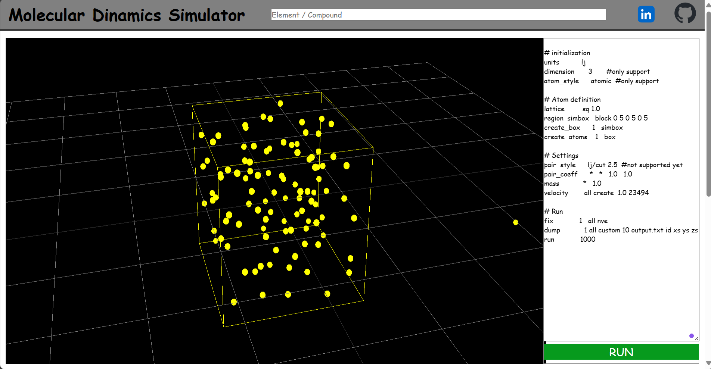

# Molecular Dynamics Simulator

This Project is MoleculaR Dynamics Simulator made using Vite, TypeScript and Three.js

> [!IMPORTANT]
> This site will be hosted here: [GitHub Pages](https://pages.github.com/).

## To-Do List
- [ ] work on keep particles in box 
- [ ] fix particles so they don't expell each other to infinity
- [ ] learn how to host it on a website
- [ ] make run button work properly
